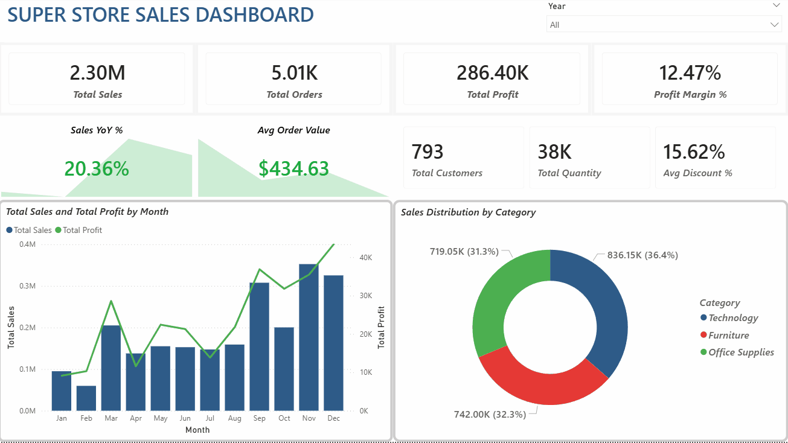

# 📊 Superstore Sales Analysis

## 1. Project Overview

This project analyzes a retail superstore's sales data 
to uncover insights about sales performance, product 
profitability, regional trends, customer behavior, 
and the impact of discounts on profit.

The goal is to provide **data-driven business recommendations** 
to help the company improve revenue, reduce losses, 
and optimize discount strategy.

**This is an end-to-end data analysis project** using:
- Python for data cleaning and exploratory data analysis
- SQL for structured querying
- Power BI for interactive dashboard visualization

---

## 2. Dataset

| Item | Detail |
|------|--------|
| Source | [Kaggle — Superstore Dataset](https://www.kaggle.com/datasets/vivek468/superstore-dataset-final) |
| Records | ~9,994 |
| Columns | 21 |
| Time Period | 2014 — 2017 |

**Key columns used:**
- Order Date, Ship Date, Ship Mode
- Customer ID, Customer Name, Segment
- Country, State, City, Region
- Product ID, Category, Sub-Category
- Sales, Quantity, Discount, Profit

---

## 3. Tools Used

| Tool | Purpose |
|------|---------|
| **Python** | Data cleaning, EDA, visualization |
| **Pandas / NumPy** | Data manipulation |
| **Matplotlib / Seaborn** | Charts and plots |
| **SQL** | Data querying |
| **Power BI** | Interactive dashboard |
| **Jupyter Notebook** | Analysis environment |
| **Git / GitHub** | Version control |

---

## 4. Project Structure

```
superstore-sales-analysis/
│
├── data/
│   ├── raw/
│   │   └── superstore.csv
│   └── processed/
│       └── superstore_cleaned.csv
│
├── notebooks/
│   ├── 01_data_cleaning.ipynb
│   ├── 02_sales_performance.ipynb
│   ├── 03_product_analysis.ipynb
│   ├── 04_regional_analysis.ipynb
│   ├── 05_customer_analysis.ipynb
│   └── 06_discount_profitability.ipynb
│
├── sql/
│   └── analysis_queries.sql
│
├── dashboard/
│   └── dashboard_preview.gif
│
├── images/
│   └── (all chart images)
│
├── reports/
│   └── tables/
│       └── (all CSV summary tables)
│
├── README.md
├── requirements.txt
└── .gitignore
```

---

## 5. Analysis Workflow

```
Step 1 → Data Cleaning
         Handle missing values, duplicates,
         convert data types, create new columns

Step 2 → Sales Performance Analysis
         KPIs, yearly/monthly/quarterly trends,
         seasonality patterns

Step 3 → Product Analysis
         Category & sub-category performance,
         top/bottom products, loss-making products

Step 4 → Regional Analysis
         Region/state/city performance,
         loss-making states, geographic patterns

Step 5 → Customer Analysis
         Segment performance, top customers,
         order behavior, Pareto analysis

Step 6 → Discount & Profitability Analysis
         Discount impact, discount bands,
         category/region/segment discount patterns

Step 7 → SQL Queries
         Structured queries for key business questions

Step 8 → Dashboard
         Interactive Power BI dashboard
```

---

## 6. Key Findings

### 📈 Sales Performance
* **Consistent Long-Term Growth:** Annual Sales expanded from sub-$480k (2014) to over $730k (2017). Annual Profit successfully scaled in tandem, nearly doubling by the end of 2017.
* **Strong Q4 Cyclicality:** Sales performance heavily relies on seasonal demand. **Q4 (September - December)** acts as the primary revenue and profit driver, with November consistently marking the historical sales peak.
* **The Q1 Post-Holiday Slump:** A sharp, recurring drop-off occurs every **January and February**. February stands out as the weakest month of the year, suffering from severely depleted consumer demand.
* **The Profit Margin Trap (Jan 2015 Anomaly):** While sales dropped in January 2015, **profitability collapsed into a net loss**. This indicates aggressive, low-margin liquidation or excessive discounting strategies to clear holiday inventory, damaging bottom-line returns.

### 📦 Product Analysis
* **The Revenue Engine vs. Profit Drainer:** While **Technology** drives substantial revenue with a healthy profit margin, **Furniture** represents a major profit drain. Despite holding a significant **32.3% share of total sales**, Furniture generates almost zero net profit due to extremely thin margins.
* **The Sub-Category Value Destroyers:** A deep dive into sub-categories reveals that **Tables** and **Bookcases** are heavily loss-making, despite achieving high sales. Conversely, **Copiers**, **Phones**, and **Accessories** emerge as the primary profit engines of the business.
* **The Over-Discounting Core Correlation:** There is a direct, negative correlation between discount levels and profit margins. **Tables**, **Bookcases**, and **Supplies** suffer from the highest average discount rates (all exceeding 20%), which directly destroys their profitability and pushes their net margins into negative territory.

### 🌍 Regional Analysis
* **The Revenue-Margin Decoupling:** The **West** and **East** regions are the powerhouse of the business, leading in both raw sales and net profit. However, the **Central** region presents a critical operational bottleneck. Despite bringing in a substantial **$501k in sales**, it generates a meager **$39.7k in profit**, resulting in the lowest net profit margin across all regions (**7.92%**).
* **The "Discount-Margin" Direct Link:** The underperformance of the Central region is heavily correlated with pricing behavior. The Central region enforces an alarming average discount rate of **24.04%**—almost double the discount rate of the highly profitable West region (10.93%). This over-discounting cultural habit directly causes the regional margin erosion.
* **Regional Category Breakdown:** A breakdown within the Central region shows that **Furniture is actively loss-making (Negative Profit)**, while its Technology sales yield far less profit compared to the East and West regions due to the same systemic discounting issue.
* **The High-Yield Strongholds:** **California** and **New York** (and their respective hubs, **New York City** and **Los Angeles**) stand out as highly efficient markets, dominating the top spots for both sales volume and net profitability.
* **The High-Volume Value Destroyers:** A severe structural anomaly is identified in **Texas**, **Ohio**, and **Pennsylvania**. Texas ranks **3rd in Total Sales ($170k+)** nationwide but ranks as the **#1 most loss-making state**, losing over **$25,000** in net profit. This confirms that the store is scaling losses rather than profits in these major territories.

### 👥 Customer Analysis
* **The Volume Driver (Consumer Segment):** The **Consumer** segment is the absolute heavyweight of the business, capturing the largest market share with **over 50% of total sales** and driving the highest absolute profit.
* **The Margin Efficiency Paradox:** While the Consumer segment dominates in volume, the **Corporate** and **Home Office** segments operate with comparable or slightly higher pricing efficiency. 
* **Uniform Discounting Across Segments:** Interestingly, the average discount rate is relatively uniform across all three segments (hovering around 15%). This indicates that the profit erosion found in previous product/regional analyses is driven by specific product categories or geographic regions rather than a specific customer segment behavior.
* **Validation of the Pareto Principle (80/20 Rule):** The **Customer Pareto Analysis** chart reveals a classic concentration of revenue: a vital minority of top-tier customers generates a disproportionately large share of total cumulative sales. 
* **The High-Volume Whale Risk (Sales vs. Profit Disconnect):** A critical anomaly appears when cross-referencing the **Top 10 Customers by Sales** against the **Top 10 Customers by Profit**. Some "whale" customers (e.g., *Sean Miller*) generate monumental sales figures but are actually **heavily loss-making (Negative Profit)** for the business. This occurs when high-volume clients abuse contract pricing, bulk discounts, or high-freight delivery options.
* **Order Frequency Distribution:** The **Customer Order Distribution** chart indicates that the majority of customers place a moderate number of orders, highlighting a healthy baseline of customer acquisition alongside a core group of high-frequency buyers.

### 💰 Discount & Profitability
* **The Sweet Spot (1% - 10% Discount):** The data dispels the myth that no discounts are best. Interestingly, items with a **Very Low Discount (1% - 10%)** yield the highest average profit per order (**$96.06**), outperforming the zero-discount strategy ($66.90). This indicates that minor, targeted incentives successfully drive high-margin conversions.
* **The Inflexion Point of Value Destruction (The 20% Threshold):** A critical cliff is identified at the **20% discount mark**. As clearly shown in the *Scatter Plot* and *Discount Band* charts, any promotion exceeding 20% immediately drags the average order profit into negative territory (**Net Loss**). 
* **The Hemorrhage of High Discounts (21% - 80%):** Once discounts enter the Medium to Very High bands (21% to 80%), profitability completely collapses. Orders with over 30% discount lose an shocking average of **~$106 to $109 per transaction**, severely bleeding the company's bottom line.
* **Bimodal Distribution Risk:** The *Distribution of Discount Levels* shows that the store's promotional strategy is highly reactive, clustering heavily at **0% (no discount)** and **20% (the exact border of profitability)**, with dangerous spikes remaining at 70% and 80%.
* **High Frequency of Profit-Killing Orders:** The *Order Count by Discount Level* chart confirms that thousands of orders are being processed at the 20% mark or higher, magnifying the total cumulative loss across the entire ecosystem.

---

## 7. Business Recommendations

Based on the analysis, the following actions are recommended:

1. Promotional Policy & Pricing Guardrails (Core Margin Protection)
* **Enforce a Strict 20% Discount Hard Cap:** System-wide rules must be implemented in the POS/ERP system to block any discount $\ge 20\%$ without executive financial approval, as data proves this is the exact threshold where transactions collapse into net losses.
* **Optimize to the Pricing "Sweet Spot":** Restructure marketing promotions to focus exclusively on low-tier discounting (**5% to 10%**). This range maximizes purchase intent while driving the highest average profit per order ($96.06).
* **Eliminate Toxic High-Discount Liquidation:** Completely phase out individual product price cuts of 70%–80%. Instead, liquidate stagnant inventory by bundling slow-moving items (e.g., Furniture) with high-margin items (e.g., Technology Accessories).

2. Product Portfolio Rationalization & Supply Chain Optimization
* **Restructure Loss-Making Categories:** Immediately halt broad promotions on **Tables** and **Bookcases**. If their high overhead is driven by shipping and logistics costs, re-negotiate third-party logistics (3PL) freight contracts or adjust their base retail price.
* **Implement Value-Based Commissions:** Pivot the sales team's performance incentives from raw **Sales Volume** to **Net Profit Margin**. Direct marketing budgets away from low-margin Furniture and heavily reinvest in high-yielding categories like **Technology (Copiers, Phones)** and **Office Supplies (Paper, Labels)**.

3. Regional Restructuring & Capital Reallocation
* **De-escalate Promotions in Negative-Profit Territories:** Mandate an immediate freeze on automatic promotional pricing and contract chiết khấu in **Texas** and **Ohio**. Despite their high sales volumes, these states are currently scaling financial losses rather than profits.
* **Reallocate Marketing Spend to High-Efficiency Hubs:** Shift capital away from the underperforming Central region (which suffers from an aggressive 24.04% over-discounting culture) and double down on highly efficient market strongholds like **California** and **New York**.

4. Customer Portfolio Management & Lifetime Value (LTV)
* **Audit and Renegotiate High-Volume "Whale" Accounts:** Conduct a dedicated financial audit on high-volume, loss-making customer accounts (such as *Sean Miller*). Restructure their contracts by removing automatic bulk discounts and introducing Minimum Order Values (MOV) to cover logistics costs.
* **VIP Retention Program:** Build exclusive loyalty or account-management workflows for top-tier profitable clients (such as *Tamara Chand* and *Raymond Buch*) to maximize retention of these high-margin buyers.
* **Proactive Q1 Counter-Cyclical Planning:** To cushion the recurring post-holiday slump in January and February, establish a cash reserve from profitable Q4 earnings and introduce targeted B2B corporate sales campaigns tailored to new-year enterprise budgets.

---

## 8. Dashboard Preview



> Interactive Power BI dashboard with 4 pages:
> Executive Overview, Product Performance, 
> Regional Analysis, and Discount Analysis.

---

## 9. SQL Queries

Key SQL queries are available in `sql/analysis_queries.sql`.

Example queries include:
- Total sales, profit, and orders
- Sales and profit by year and month
- Category and sub-category performance
- Loss-making states and products
- Discount band profitability analysis

---


## 10. What I Learned

This project helped me practice and demonstrate:

- **Data Cleaning**: handling missing values, duplicates, 
  data type conversion
- **Exploratory Data Analysis**: asking business questions 
  and answering them with data
- **Data Visualization**: creating meaningful charts 
  that communicate insights clearly
- **SQL**: writing structured queries to extract 
  business metrics
- **Dashboard Design**: building interactive dashboards 
  for business stakeholders
- **Business Thinking**: translating data findings 
  into actionable recommendations

---

## 11. Author

**Your Name**

- GitHub: [toilakhanh123123](https://github.com/toilakhanh123123)
- LinkedIn: (your link — optional)
- Email: (your email — optional)
